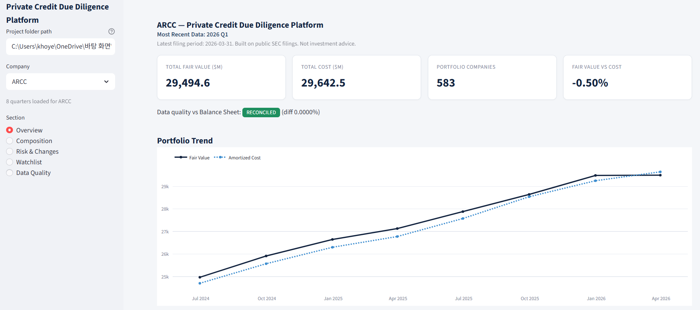

# Private Credit Due Diligence Platform

**A private credit portfolio risk monitoring and due diligence tool built directly on
public SEC filings (10-Q/10-K) - no third-party data vendor required.**

<!-- Add a dashboard screenshot here, e.g.: -->
<!--  -->

## Why This Project

- Automates the recurring quarterly review of a BDC's portfolio holdings
- Pulls the raw SEC filing and parses the actual portfolio holdings table, not just
  the pre-tagged XBRL summary (which is missing key fields like non-accrual status)
- Reconciles parsed figures against the filer's own Balance Sheet
- Produces the kind of output an investment risk analyst would use: a scored
  watchlist, quarter-over-quarter portfolio changes, and a rule-based IC memo

## What It Does

- **Fully automated data pipeline**: filing discovery -> raw document parsing ->
  reconciliation, for any quarter, without hardcoded page numbers or one-off
  assumptions baked into the shared logic
- **Two BDCs validated end-to-end** (Ares Capital / ARCC, Blackstone Secured Lending /
  BXSL), each reconciled against the company's own Balance Sheet with effectively 0%
  error across 8 quarters
- **Non-accrual detection** that dynamically identifies the correct footnote number in
  each filing (numbering isn't consistent across quarters or filers) and cross-checks
  the result against the officially disclosed percentage
- **Watchlist Score**: a transparent, rule-based early warning score per portfolio
  company (non-accrual, fair value markdowns, sector concentration), explicitly framed
  as a prioritization tool rather than a black-box prediction model
- **Deterministic IC Memo generator**: every number and conclusion is calculated, not
  generated by a language model - reproducible by design
- **Interactive Streamlit dashboard**: portfolio composition, concentration,
  non-accrual trends, watchlist, and reconciliation history, each downloadable to Excel

## Tech Stack

Python, pandas, BeautifulSoup/lxml, SQLite, Streamlit, Plotly

## Quick Start

One command, every time - always includes your email, always refreshes data,
then opens the dashboard:

```
cd project-folder
pip install -r requirements.txt
python start.py your_email@example.com
```

`start.py` checks whether `parsed/dd_platform.db` already exists. If not, it runs
`run_pipeline.py` (collects 8 quarters of data for both ARCC and BXSL from SEC EDGAR -
this takes a while, it's fetching and parsing real filings) and then launches the
Streamlit dashboard. If the database already exists, it skips data collection entirely
and jumps straight to the dashboard - so this is the one command to use every time,
first run or the hundredth. To force a fresh re-collection, delete
`parsed/dd_platform.db` first (or run `python run_pipeline.py <email>` directly).

SEC requires a real contact email in the User-Agent header for every request. This
project never hardcodes an email - it's passed as a command-line argument to
`run_pipeline.py`, or set programmatically via:

```python
from src.sec_client import set_contact_email
set_contact_email("you@example.com")
```

The Streamlit dashboard itself never contacts SEC directly (it only reads the
already-collected database), so no email is needed to run it.

## Completed (as of 2026-07-05)

- Phase 1: Filing Discovery (`src/discovery.py`) - most recent 8 10-Q/10-K filings per company
- Phase 2: Automatic R-file discovery from FilingSummary.xml (`src/filing_summary.py`) - used
  to locate the Balance Sheet; the Schedule of Investments R-file is not actually used since
  it lacks narrative columns (see notes below)
- Phase 3: Extracting total investments at fair value from the Balance Sheet, with automatic
  unit detection (millions/thousands) (`src/balance_sheet.py`, `src/fetch_balance_sheet.py`) -
  validated across all 8 quarters for both companies
- Phase 4: Parsing the real Schedule of Investments table from the original filing document
  (iXBRL) (`src/soi_table.py`, `src/fetch_soi_full.py`, `src/pipeline_phase4.py`)
  - Automatically groups colspan-duplicated columns by header label
  - Automatically classifies sector headers / company first row / tranche continuation rows /
    company subtotals / grand total
  - The comparative (prior year-end) schedule that appears alongside the current quarter's
    schedule in each 10-Q is automatically cut off at the grand total row
  - **All 8 quarters reconcile against the Balance Sheet total with effectively 0% error**
  - Line-item data is stored in `portfolio_holdings`; reconciliation results are logged in
    `data_quality_checks`
- Non-Accrual detection (`src/footnote_legend.py`) - finds the phrase "Loan was on
  non-accrual status" in the filing's own footnote legend and dynamically detects which
  footnote number it corresponds to for that specific filing, then matches it against
  `portfolio_holdings.non_accrual` (no hardcoded footnote numbers)
- Grade Distribution parsing (`src/grade_distribution.py`) - portfolio-wide grade (1-4)
  distribution, weighted average grade, and the officially disclosed non-accrual % are stored
  in `financial_metrics`. Confirmed that line-item risk ratings are not disclosed in these
  filings (only portfolio-level aggregates are)
- Our computed non-accrual % (fair value basis) is automatically cross-checked against the
  officially disclosed figure in the filing (logged as `non_accrual_pct_reconciliation` in
  `data_quality_checks`, tolerance 0.2 percentage points)
- Watchlist Score (`src/watchlist_score.py`) - rule-based early warning score per issuer
  - Non-accrual (+3, plus +1 if newly entered this quarter) / Fair Value below 80% of Cost (+2) /
    markdown deteriorating for 2 consecutive quarters (+2) / sector concentration above 15% (+1)
  - Buckets: Green (0-2) / Yellow (3-5) / Orange (6-8) / Red (9+)
  - Explicitly framed as "an illustrative rule-based early warning framework intended to
    prioritize analyst review rather than predict default" - a prioritization tool, not a
    prediction model
  - Visible in the Streamlit Watchlist tab as bucket counts plus a color-coded detail table
- MD&A text extraction (`src/mdna_extract.py`) - distinguishes the real "Item 2." section
  header from its appearance in the table of contents by measuring the distance to the next
  "Item 3." (no hardcoded character positions)
- IC Memo generator (`src/ic_memo.py`) - 100% rule-based, generated deterministically without
  any LLM
  - Portfolio snapshot, Grade Distribution/Non-Accrual trends, Watchlist summary, new/exited
    issuers, data limitation disclosures, and an overall assessment (Improving/Stable/
    Deteriorating) are all derived from calculated figures
  - Issuer name normalization (`normalize_issuer_name`) prevents false new/exited issuer counts
    caused by footnote-number suffixes or separator differences (`&` vs `/`) - while protecting
    abbreviations like `d/b/a`

## Peer Expansion: BXSL (as of 2026-07-05)

A second BDC (Blackstone Secured Lending Fund) is now fully validated across all 8 quarters.
Its filing format differs substantially from ARCC's, so a BXSL-specific adapter
(`src/soi_table_bxsl.py`, `src/pipeline_bxsl.py`) was built. Shared logic
(`collapse_grouped_columns` / `_clean_value` in `src/soi_table.py`, `src/watchlist_score.py`,
`src/ic_memo.py`, `src/mdna_extract.py`) was reused without any code changes.

### Differences between ARCC and BXSL

- Balance Sheet statement name: ARCC uses "Consolidated Balance Sheets", BXSL uses
  "Statements of Assets and Liabilities" - `find_balance_sheet_reports`'s pattern was
  broadened to match both
- How "Investments at fair value" is presented: ARCC has a separate "Fair Value" row below
  the header, while BXSL puts the number directly on the "Investments at fair value" label -
  `extract_total_investments_fair_value` now takes a `label_candidates` parameter instead of
  a hardcoded "fair value" string
- Schedule of Investments header keywords: ARCC uses "Company" + "Business Description", BXSL
  uses entirely different labels ("Investments", "Footnotes", etc.) -
  generalized via `find_header_row_generic`
- BXSL packs two distinct values into a single column group ("Reference Rate and Spread"
  contains both "SOFR +" and "6.00%") - `collapse_grouped_columns` was generalized to
  concatenate distinct de-duplicated values within a group instead of taking only the first
  (this doesn't change behavior for ARCC's single-value groups)
- BXSL has no per-company subtotal rows, only sector-level subtotals, and the company name is
  repeated on every tranche row (ARCC only shows the company name on the first tranche row,
  leaving it blank afterward) - handled by a separate `classify_and_assign_bxsl`
- BXSL identifies banner rows by checking whether the Cost field fails to parse as a number -
  depending on the quarter, a banner row's Cost field is either a repeated copy of the banner
  text or simply blank
- BXSL's grand total line reads "Total Portfolio Investments, Cash and Cash Equivalents",
  different from ARCC's "Total Investments". Several asset-class-level subtotals also appear
  along the way (e.g. "Total First Lien Debt") - these are classified separately as
  `asset_class_subtotal` and excluded from the line-item total, not mistaken for the grand total
- BXSL's Schedule of Investments grand total **includes cash and cash equivalents** (money
  market funds, etc.), while the Balance Sheet's "Investments at fair value" excludes cash -
  this discrepancy (which matched the Balance Sheet's Cash and Cash Equivalent line exactly)
  was identified, and cash-equivalent positions are now excluded from both the reconciliation
  total and the `portfolio_holdings` storage
- Unit normalization: ARCC's filing is already labeled "$ in Millions", so storing the parsed
  values directly was already correct. BXSL is labeled "$ in Thousands", so converting to raw
  dollars before storing would have produced inconsistent units across companies -
  `storage_scale = unit_multiplier / 1_000_000` ensures **every company's data is stored in
  millions of dollars**, matching what the IC Memo and Streamlit dashboard both assume

### Design principle reaffirmed

With only two adapters (ARCC, BXSL) built so far, we have deliberately not abstracted them
behind a common interface (e.g. a `BDCParserAdapter`) - it's safer to wait until a third BDC is
added and see what the two adapters genuinely have in common before generalizing (avoiding
premature abstraction). For now, each company's fetch/parse layer lives in its own file, while
the analysis layer (Watchlist Score, IC Memo, MD&A extraction) is already company-agnostic and
shared as-is.

## Next Steps (Not Yet Implemented)

- Further peer expansion beyond BXSL - would need to verify whether the grade system and
  footnote-numbering approach generalize to other filers
- Watchlist Score weights are currently arbitrary - backtesting the score's leading-indicator
  performance against historical non-accrual transitions would make it much more defensible
- IC Memo currently uses only the rule-based template (an LLM phrasing layer was built but
  removed due to API cost considerations - it can be restored from an earlier version if needed)

## Notes / Pitfalls Discovered

- The original filing document (main_doc.htm) differs from the XBRL viewer's rendered R-file
  (e.g. R5.htm). The R-file only contains tagged numeric facts, so narrative columns
  (non-accrual, risk rating, interest rate, etc.) are missing. Always parse from the original
  document instead.
- Among the tables returned by `pd.read_html(main_doc_path)`, the candidates found by
  `find_soi_page_tables()` mix together the current quarter's schedule and the comparative
  (prior year-end) schedule. `parse_all_soi_pages()` automatically stops at the first grand
  total ("Total Investments") row so only the current quarter's data remains. Never hardcode
  page indices - they differ from quarter to quarter.
- Some columns have a `"$"` sign or footnote markers (e.g. `(2)(9)`) appearing before the
  actual value, so "real" values are identified by the pattern of the cell content itself
  rather than by column position (see `_clean_value`).
- A company's tranches can be split across a page boundary, so pages must not be classified
  independently - concatenate everything first, then run `classify_and_assign` once on the
  combined data.
- The Grade Distribution table has the same pattern where a `%` sign is attached only to the
  first item and omitted afterward, so it's parsed by numeric position rather than relying on
  the symbol.

## Design Principles (for future changes)

- Keep the fetch / parse / analyze layers separated
- Manage the DB schema in one place only (`src/schema.py`); `financial_metrics.metric_name` is
  free text, so adding a new metric never requires a schema change
- Adding a company only requires a new entry in `config/companies.py` (a separate parser
  adapter may still be needed per company)
- Any parsed numeric total must be reconciled against an independent reference value (Balance
  Sheet, an officially disclosed figure in the filing, etc.) before being trusted
